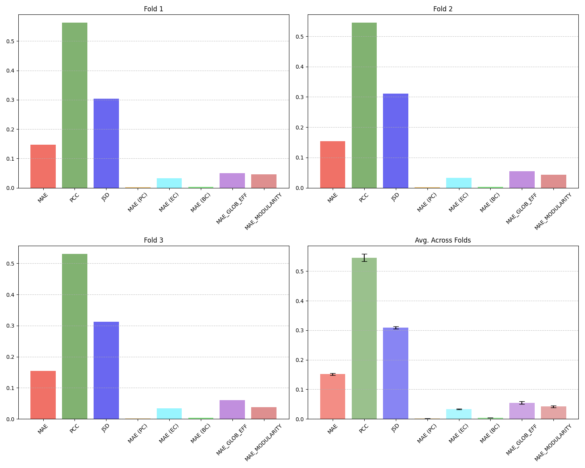

# DGL2026 Brain Graph Super-Resolution Challenge

## Contributors

- Adrian Pittaway
- Alejandro Cañada 
- Arunima Singh
- Christian Wood

## Running The Full Pipeline !
In your terminal:
- cd into the root folder of the repo (`ICL_70105_DGL_CW`)
- Create a virtualenv. Eg. `python3 -m venv venv`
- Install dependencies. Eg. `pip install -r _______` (see below for more details)
- Run the full training pipeline via `python3 -m scripts.train_NeuroSRGAN`
      - Our final chosen hyperparameters are in the dataclass NeuroSRGANArgs (instantiated on line 25 of the main script), here you can reduce epochs to save time running the whole script.
- Watch your terminal for training updates and check the `/results` folder for plots and CSVs!

### Used External Libraries
- If running the code on a GPU please run `pip install -r gpu_requirements.txt`
- If running the code on a CPU or MPU please run `pip install -r cpu_requirements.txt`

## Problem Description

Brain-graph super-resolution refers to the task of learning a mapping $f : \mathbf{A}^{LR} \mapsto \hat{\mathbf{A}}^{HR} \approx \mathbf{A}^{HR}$ from a low-resolution (LR) brain connectivity matrix
$\mathbf{A}^{LR} \in \mathbb{R}^{160 \times 160}$ to a high-resolution (HR) connectivity matrix $\mathbf{A}^{HR} \in \mathbb{R}^{268 \times 268}$ of the same subject, where  $\hat{\mathbf{A}}^{HR} \approx \mathbf{A}^{HR}$ is the desired approximation.

This problem is significant because of the inherent trade-off between data resolution and acquisition cost. High-resolution brain connectomes capture finer inter-regional neural communication patterns directly linked to cognitive function and neurological disease \cite{bullmore2009complex}. However, acquiring these requires costly, time-consuming imaging pipelines that involve extended scan times, expert preprocessing, and large cohort recruitment. Brain-graph super-resolution circumvents this restrictive burden, making fine-grained connectivity analysis more accessible without additional data collection.

## NeuroSRGAN - Methodology

**Neurodynamics-Informed Spectral Super-Resolution GAN**

NeuroSRGAN is a graph neural network for brain connectome super-resolution:
given a low-resolution (LR) brain connectivity graph (160 nodes), it predicts
the corresponding high-resolution (HR) graph (268 nodes). It extends the
AGSRNet architecture with two novel neurodynamically motivated contributions:
(1) a community-aware spectral super-resolution layer that refines the global
spectral resolution jump with learned per-community residual corrections, and
(2) a topology-aware discriminator that evaluates the structural realism of
generated graphs using a compact neurodynamic topological fingerprint.

```
LR adjacency (160×160)
        │
        ├─────────────────────────────────┐
        │                                 ▼
        │                       Louvain Clustering
        │                       (top-80th-percentile edges)
        │                       {C_1, ..., C_7}
        │                                 │
        │                                 ▼
        │                       HR community masks (268→320 padded)
        │                       mask_k = v_k · v_k^T ∈ {0,1}^{320×320}
        │                       (HR node i → LR node round(i×159/267))
        ▼                                 │
  normalize_adj_torch                     │
        │                                 │
        ▼                                 │
  GraphUnet                               │    ← hierarchical multi-scale
        │  net_outs (160×320)             │       feature extraction
        ▼                                 │
  CommunityAwareSRLayer                   │    ← spectral SR 160→320
        │  (wraps GSRLayer)               │
        └──────────────┬──────────────────┘
                       ▼
        Z_k = Z_global ⊙ mask_k          ← extract community blocks
                       │
                       ▼
        W_k = U_k · V_k^T                ← low-rank correction (r=16)
        correction_k = (Z_k @ W_k) ⊙ mask_k
                       │
                       ▼
        α = softmax([α_1, ..., α_7])     ← learned community weights
                       │
                       ▼
        Z_HR = Z_global                  ← residual addition    [NOVEL 1]
             + Σ_k α_k · correction_k
             (shape: 320×320)
                       │
                       ▼
  GraphConvolution × 2                   ← global HR refinement
        │
        ▼
  symmetrise + fill_diagonal(1)          ← enforce valid adjacency
        │
        ▼
HR adjacency prediction (320×320, padded)
        │
        ├── strip padding → (268×268) for output
        │
        ▼
  TopologyAwareDiscriminator             ← [NOVEL 2]
  input: concat([flatten(A_320), SWI, GE, Q])
  output: real/fake probability ∈ (0,1)
```

## Results



## References

- [AGSRNet](https://www.researchgate.net/publication/351298271_Brain_Graph_Super-Resolution_Using_Adversarial_Graph_Neural_Network_with_Application_to_Functional_Brain_Connectivity)

E. Bullmore and O. Sporns, “Complex brain networks: Graph theoretical analysis of structural and functional systems,” Nature reviews. Neuro-science, vol. 10, pp. 186–98, 03 2009.

M. Van Den Heuvel, R. Mandl, and H. Hulshoff Pol, “Normalized cut group clustering of resting-state fmri data,” PloS one, vol. 3, no. 4, p. e2001, 2008.

R. Salvador, J. Suckling, M. R. Coleman, J. D. Pickard, D. Menon, and E. Bullmore, “Neurophysiological architecture of functional magnetic resonance images of human brain,” Cerebral cortex, vol. 15, no. 9, pp. 1332–1342, 2005.
